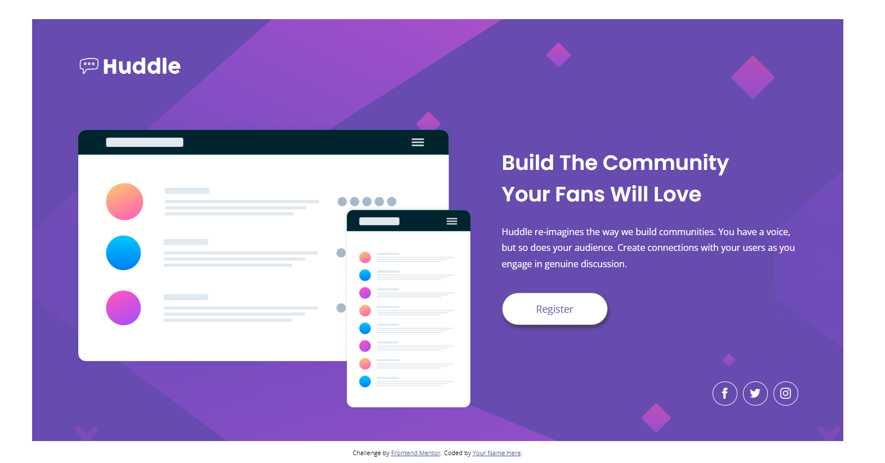
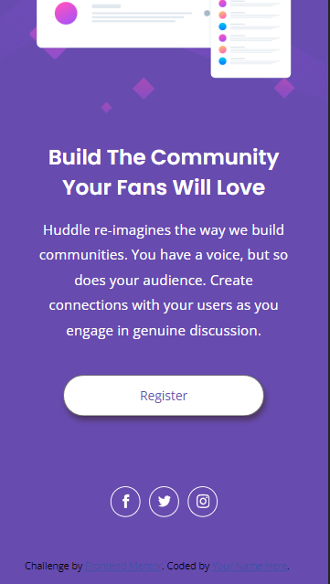

# Frontend Mentor - Huddle landing page with single introductory section solution

This is a solution to the [Huddle landing page with single introductory section challenge on Frontend Mentor](https://www.frontendmentor.io/challenges/huddle-landing-page-with-a-single-introductory-section-B_2Wvxgi0). Frontend Mentor challenges help you improve your coding skills by building realistic projects. 

## Table of contents

- [Overview](#overview)
  - [The challenge](#the-challenge)
  - [Screenshot](#screenshot)
  - [Links](#links)
- [My process](#my-process)
  - [Built with](#built-with)
  - [What I learned](#what-i-learned)
  - [Continued development](#continued-development)
  - [Useful resources](#useful-resources)
- [Author](#author)

## Overview

### The challenge

Users should be able to:

- View the optimal layout for the page depending on their device's screen size
- See hover states for all interactive elements on the page

### Screenshot

### Links

- Solution URL: [Add solution URL here](https://your-solution-url.com)
- Live Site URL: [Add live site URL here](https://your-live-site-url.com)

## My process

### Built with

- Semantic HTML5 markup
- CSS custom properties
- Flexbox
- Desktop version
- Mobile version

### What I learned

I started to understand a little bit more about Flexbox and also about svg images and how to make changes on it.
In this project i could fill how good and fast flexbox is to organize all elements in the page.

### Continued development

I still want to learn more about Flexbox and what i can create with pure HTML and CSS only.

### Useful resources

- [Aprenda Flexbox em 10 Minutos | Tutorial de HTML & CSS](https://www.youtube.com/watch?v=h4FpFvHdm-U&t=518s) - Vídeo aula explicando funcionamento do flexbox
- [iconmonstr](https://iconmonstr.com) - Site onde consegui alguns arquivos svg que me faltavam
- [Finally Figure out the SVG ViewBox - Tutorial + ViewBox Tools](https://www.youtube.com/watch?v=ciMsVVyv3Og&t=298s) - Vídeo aula explicando algumas caracteristicas do svg e como manipula-lo
- [How to Scale SVG](https://css-tricks.com/scale-svg/) - Artigo explicando como alterar a escala de um svg

## Author

- Frontend Mentor - [@Diogenes-Leal](https://www.frontendmentor.io/profile/Diogenes-Leal)